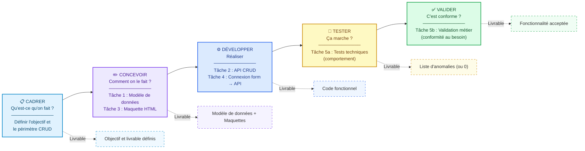

## 🔗 Schéma du processus

```mermaid
graph LR
    A["📋 CADRER<br/>Qu'est-ce qu'on fait ?<br/>─────────────<br/>Définir l'objectif et<br/>le périmètre CRUD"]
    B["✏️ CONCEVOIR<br/>Comment on le fait ?<br/>─────────────<br/>Tâche 1 : Modèle de données<br/>Tâche 3 : Maquette HTML"]
    C["⚙️ DÉVELOPPER<br/>Réaliser<br/>─────────────<br/>Tâche 2 : API CRUD<br/>Tâche 4 : Connexion form → API"]
    D["🧪 TESTER<br/>Ça marche ?<br/>─────────────<br/>Tâche 5a : Tests techniques<br/>(comportement)"]
    E["✅ VALIDER<br/>C'est conforme ?<br/>─────────────<br/>Tâche 5b : Validation métier<br/>(conformité au besoin)"]

    A --> B --> C --> D --> E

    A -.Livrable.-> A1["Objectif et livrable définis"]
    B -.Livrable.-> B1["Modèle de données + Maquettes"]
    C -.Livrable.-> C1["Code fonctionnel"]
    D -.Livrable.-> D1["Liste d'anomalies (ou 0)"]
    E -.Livrable.-> E1["Fonctionnalité acceptée"]

    style A fill:#e0f2fe,stroke:#0284c7,stroke-width:2px,color:#0c4a6e
    style B fill:#ede9fe,stroke:#7c3aed,stroke-width:2px,color:#4c1d95
    style C fill:#dbeafe,stroke:#2563eb,stroke-width:2px,color:#1e3a8a
    style D fill:#fef9c3,stroke:#ca8a04,stroke-width:2px,color:#713f12
    style E fill:#dcfce7,stroke:#16a34a,stroke-width:2px,color:#14532d

    style A1 fill:#f0f9ff,stroke:#0284c7,stroke-dasharray: 5 5
    style B1 fill:#f5f3ff,stroke:#7c3aed,stroke-dasharray: 5 5
    style C1 fill:#eff6ff,stroke:#2563eb,stroke-dasharray: 5 5
    style D1 fill:#fefce8,stroke:#ca8a04,stroke-dasharray: 5 5
    style E1 fill:#f0fdf4,stroke:#16a34a,stroke-dasharray: 5 5
```

