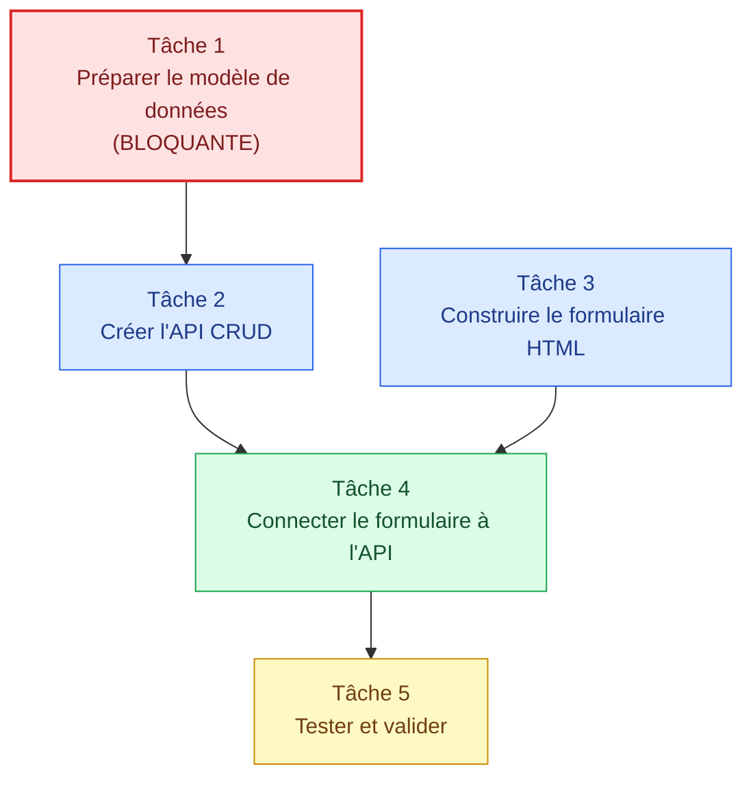

# Décomposition — Gérer les catégories

## 🎯 Fonctionnalité
**Gérer les catégories** — L'administrateur doit pouvoir consulter, ajouter, modifier et supprimer des catégories.

## 🧩 Tâches et dépendances

| # | Tâche | Dépendance | Critères de validation |
|---|-------|------------|------------------------|
| **1** | Préparer le modèle de données (table SQL `categories` : id, nom, couleur, icone) | Aucune (**bloquante**) | Table existante + INSERT de test OK |
| **2** | Créer l'API CRUD (`GET`, `POST`, `PUT`, `DELETE` /categories) | Tâche 1 | Endpoints testés, codes HTTP corrects |
| **3** | Construire le formulaire HTML (nom, couleur, icone + tableau) | Aucune (parallélisable) | Formulaire visible et accessible |
| **4** | Connecter le formulaire à l'API | Tâches 2 et 3 | Création réelle + liste mise à jour |
| **5** | Tester et valider | Tâche 4 | Tous les scénarios passent |

## 🔗 Schéma des dépendances



## 🎨 Légende

- 🔴 **Tâche 1** — Bloquante (point de départ)
- 🔵 **Tâches 2 et 3** — Développement (parallélisables partiellement)
- 🟢 **Tâche 4** — Point de convergence
- 🟡 **Tâche 5** — Validation finale

## 📌 Chemin critique

```
Tâche 1 → Tâche 2 ──┐
                    ├──→ Tâche 4 → Tâche 5
Tâche 3 ────────────┘
```