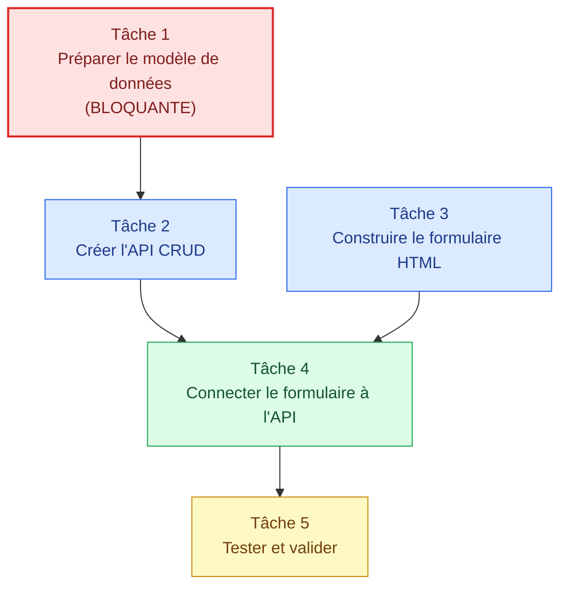

## 🔗 Schéma des dépendances

```mermaid
graph TD
    T1["Tâche 1<br/>Préparer le modèle de données<br/>(BLOQUANTE)"]
    T2["Tâche 2<br/>Créer l'API CRUD"]
    T3["Tâche 3<br/>Construire le formulaire HTML"]
    T4["Tâche 4<br/>Connecter le formulaire à l'API"]
    T5["Tâche 5<br/>Tester et valider"]

    T1 --> T2
    T2 --> T4
    T3 --> T4
    T4 --> T5

    style T1 fill:#fee2e2,stroke:#dc2626,stroke-width:2px,color:#7f1d1d
    style T2 fill:#dbeafe,stroke:#2563eb,color:#1e3a8a
    style T3 fill:#dbeafe,stroke:#2563eb,color:#1e3a8a
    style T4 fill:#dcfce7,stroke:#16a34a,color:#14532d
    style T5 fill:#fef9c3,stroke:#ca8a04,color:#713f12
```

